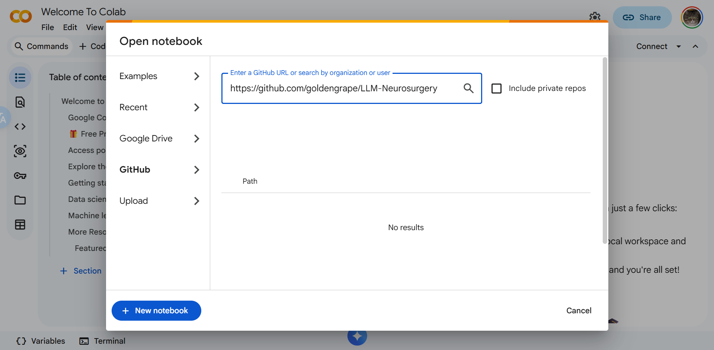

# GitHub 与 Colab 联动指南

本指南将帮助你在 Google Colab 和 GitHub 之间丝滑地同步代码，确保持续开发不会丢失进度。

## 1. 从 GitHub 导入项目到 Colab
最直接的方法是直接在 Colab 中打开你的 GitHub Notebook：



1. 打开 [Google Colab](https://colab.research.google.com/)
2. 在弹出的窗口中选择 **GitHub** 标签页。
3. 授权 Colab 访问你的 GitHub 账号。
4. 搜索或输入本项目的开源仓库名称：`goldengrape/LLM-Neurosurgery`（如果你已经 Fork 到了自己的账号，则输入你自己的用户名）。
5. 在下拉列表中选择对应的 Branch 和具体的 Notebook 文件打开。

> **小贴士**: 如果你在看 GitHub 上的 `.ipynb` 文件，也可以把 URL 中的 `github.com` 改成 `colab.research.google.com/github` 来快速在 Colab 打开。

## 2. 克隆仓库与配置环境 (推荐深入开发者使用)
如果你的代码需要互相调用，或读取本地的脚本，建议整体克隆仓库。
在 Colab Notebook 第一个单元格中运行：

```bash
# 对于 0 基础新手，我们直接克隆公开的开源仓库即可
!git clone https://github.com/goldengrape/LLM-Neurosurgery.git

# 进入克隆好的项目目录
%cd /content/LLM-Neurosurgery

# 在这里我们可以安装项目依赖（Colab 已预装了非常多好用的基本库，我们只需补充不足的即可）
!pip install torch transformers peft trl accelerate bitsandbytes datasets
```

## 3. 保存你的实验进度
由于本课程基于免费的 Colab 实例，关闭网页后数据会被重置。为此，保存你的代码进度最简单、对新手最友好的方式是：

1. 点击 Colab 菜单栏的 **File (文件)**。
2. 选择 **Save a copy in GitHub (在 GitHub 中保存副本)** 或 **Save a copy in Drive (在云端硬盘中保存副本)**。
3. 按照弹出的提示授权，你可以将修改后的 Notebook 直接保存在你自己的 GitHub 账号下或是云端硬盘中，方便以后随时回顾。

## 4. 持久化存储数据 (Google Drive 挂载)
由于 Colab 实例会在一定时间无活动后重置，所有的文件都会丢失，对于巨大的模型权重或数据集，必须保存在 Google Drive。

```python
from google.colab import drive
drive.mount('/content/drive')
```
模型和数据存放路径建议设置为 `/content/drive/MyDrive/LLM_data`。

## 5. Standard Operation Procedure (SOP): 下载大型开源模型并持久化到 GDrive
**假设你要运行一个 10GB 的 Qwen3.5 模型:**
1. 挂载 Google Drive
2. 在 GDrive 内创建一个永久保存权重的文件夹。
3. 利用 Hugging Face 官方工具下载到指定目录，防止每次启动重复下载。

```python
import os
from huggingface_hub import snapshot_download

# 指定模型保存路径在你的云盘中
cache_dir = "/content/drive/MyDrive/LLM_data/huggingface_models"
os.makedirs(cache_dir, exist_ok=True)

# 下载模型并使用刚才指定的 cache_dir
model_id = "Qwen/Qwen3.5-4B"
snapshot_download(repo_id=model_id, cache_dir=cache_dir)
```
这样，就算下次实例重置，只要再次挂载 Drive 并且指定同一个 `cache_dir`，Hugging Face transformers 库就会自动加载已存在的模型。
